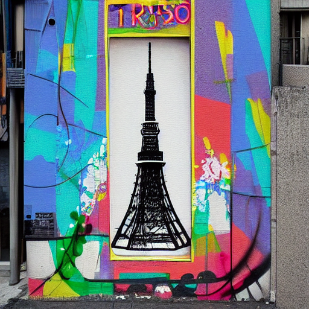

# stable_diffusion.openvino.lamda

Implementation of Text-To-Image generation using Stable Diffusion on AWS Lambda(x86_64).
<p align="center">
  
</p>

```
This project is based on the "stable_diffusion.openvino" project and ported to AWS Lambda.
https://github.com/bes-dev/stable_diffusion.openvino
```

## Requirements

* AWS Lambda(x86_64)
* Python 3.9

## Installation Instructions
### 1. Installing AWS CLI & Docker
Install AWS CLI and Docker.
- AWS CLI
https://docs.aws.amazon.com/cli/latest/userguide/getting-started-install.html

- Docker
https://docs.docker.com/engine/install/

### 2. Config AWS CLI
Input AWS Access Key ID, AWS Secret Access Key, Default region name
```bash
$ aws configure
AWS Access Key ID [None]: YOUR ACCESSKEY
AWS Secret Access Key [None]: YOUR SECRETKEY
Default region name [None]: YOUR REGION (ex.us-east-1)
Default output format [None]:
```

### 3. Clone Project
```bash
$ git clone https://github.com/densenkouji/stable_diffusion.openvino.lambda.git
$ cd stable_diffusion.openvino.lambda
```

### 4. Install
```bash:
$ sh ./install.sh
(Create New) Input AWS Lambda Function Name [ex.mySdFunction]: YOUR LAMBDA FUNCTION NAME
```
Results
```bash
TRACINGCONFIG   PassThrough
******* Complete!! *******
The following resources were created.
- Lmabda function: mySdFunction-yty7mdazmzzlywey
- Role: mySdFunction-yty7mdazmzzlywey-role
- ECR Repository: mysdfunction-yty7mdazmzzlywey-repo
- S3 Bucket: mysdfunction-yty7mdazmzzlywey-bucket
```

### 5. Test(Text-To-Image)

```bash
$ aws lambda invoke \
   --function-name mySdFunction-yty7mdazmzzlywey \
   --invocation-type 'RequestResponse' \
   --payload '{"prompt":"Street-art painting of Tower in style of Banksy"}' \
   --cli-read-timeout 600 \
   --cli-binary-format raw-in-base64-out \
   output.text
```

## Generate image from text description

```bash
usage: 
{
  "prompt": "Street-art painting of Tower in style of Banksy"
}

optional arguments:
  seed SEED           random seed for generating consistent images per prompt
  beta-start BETA_START LMSDiscreteScheduler::beta_start
  beta-end BETA_END     LMSDiscreteScheduler::beta_end
  beta-schedule BETA_SCHEDULE LMSDiscreteScheduler::beta_schedule
  num-inference-steps NUM_INFERENCE_STEPS num inference steps
  guidance-scale GUIDANCE_SCALE guidance scale
  eta ETA eta
  prompt PROMPT prompt
  init-image INIT_IMAGE path to initial image
  strength STRENGTH   how strong the initial image should be noised [0.0, 1.0]
  mask MASK           mask of the region to inpaint on the initial image
  output OUTPUT       prefix output image name
  ```

## Acknowledgements
* stable_diffusion.openvino: https://github.com/bes-dev/stable_diffusion.openvino
* Original implementation of Stable Diffusion: https://github.com/CompVis/stable-diffusion
* diffusers library: https://github.com/huggingface/diffusers

## Disclaimer

The authors are not responsible for the content generated using this project.
Please, don't use this project to produce illegal, harmful, offensive etc. content.
